# 🧪 Plotly-Lab

**Plotly-Lab** is a repository of visualizations created with [Plotly](https://plotly.com/) using a variety of random datasets.  
There's no fixed theme — it's a space for freely exploring data and visualization possibilities with Plotly in an experimental way.

---

## 📊 Visualizations

Below is a gallery showing some of the generated charts.  
Click on any image to view it in full size.

### Packed Bubble Chart

<table>    
  <tr>
    <td>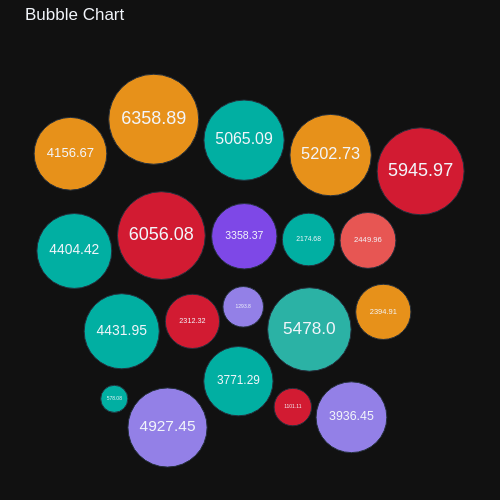</td>
    <td>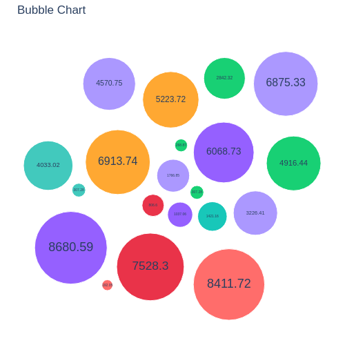</td>
    <td>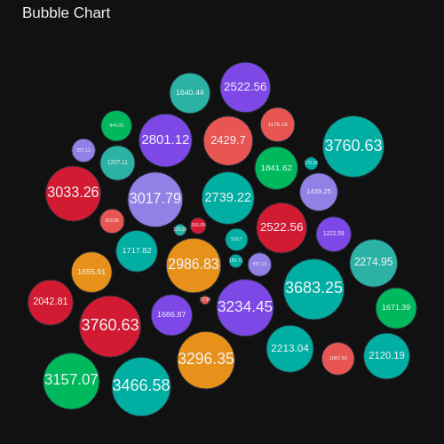</td>
  </tr>
</table>

### Parliament Chart

<table>    
  <tr>
    <td>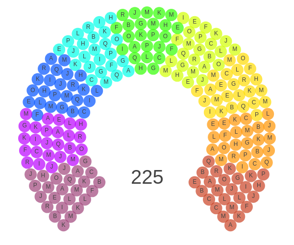</td>
    <td>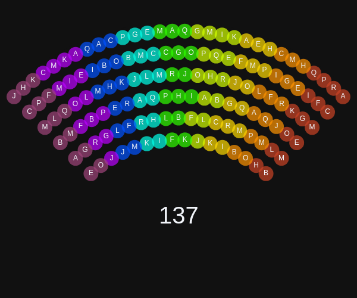</td>
    <td>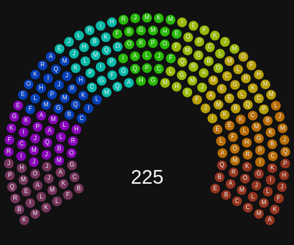</td>
  </tr>
</table>

### Pictorial Stacked Chart

<table>    
  <tr>
    <td>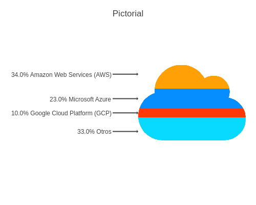</td>
    <td>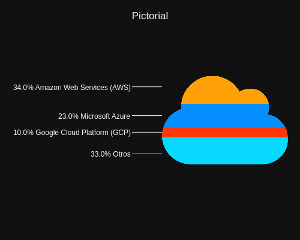</td>
    <td></td>
  </tr>
</table>

### Plotly Figure Friday

<table>    
  <tr>
    <td>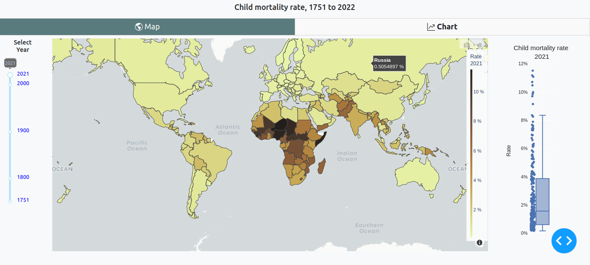</td>
    <td>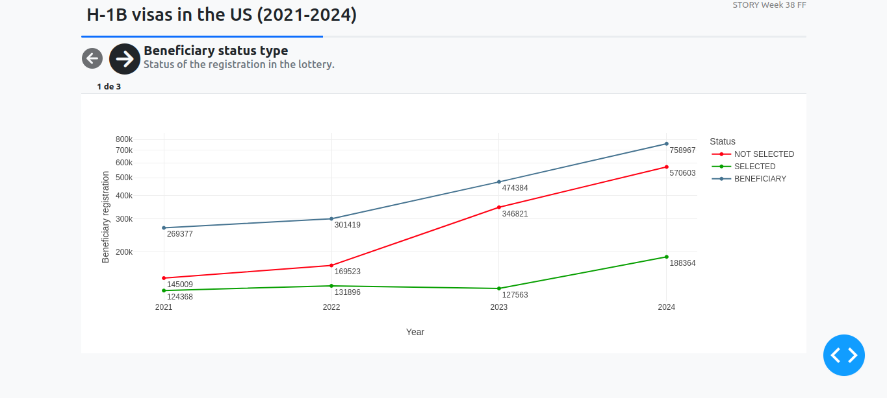</td>
    <td></td>        
  </tr>
  <tr>
    <td>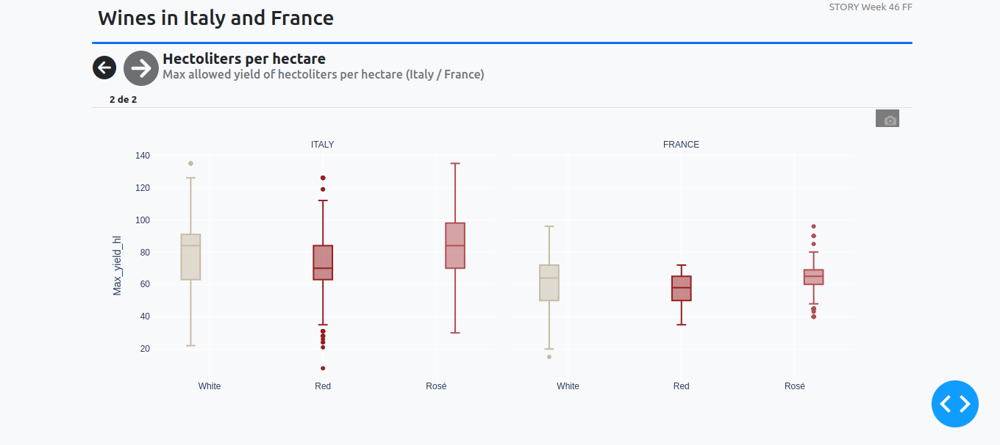</td>
    <td>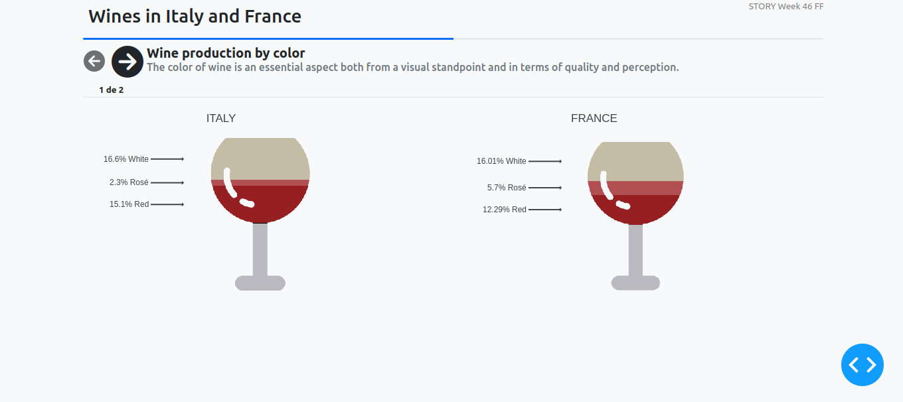</td>
    <td>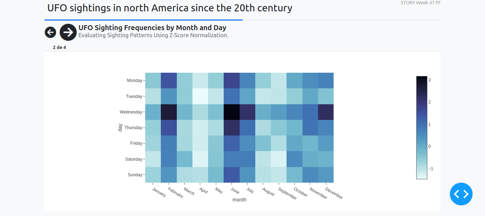</td>        
  </tr>
  <tr>
    <td>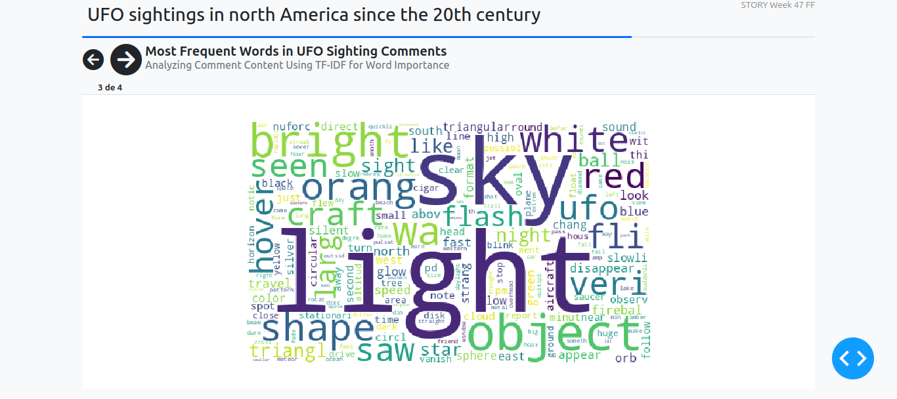</td>
    <td>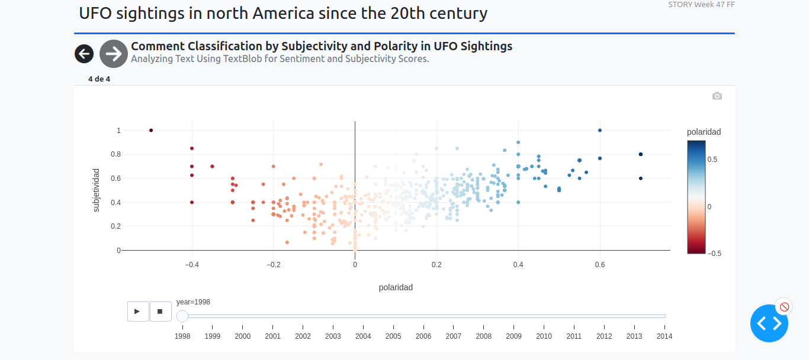</td>
    <td>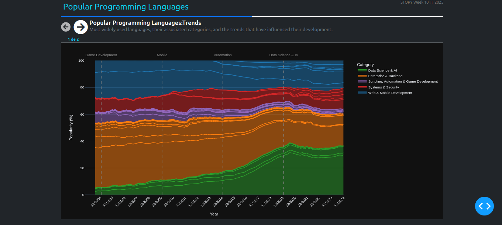</td>        
  </tr>
  <tr>
    <td>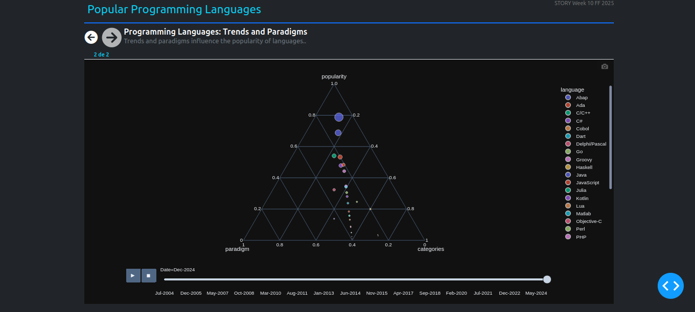</td>
    <td>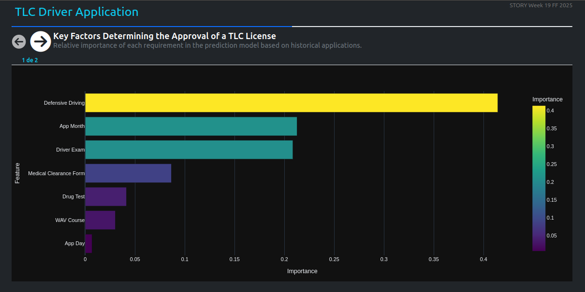</td>
    <td>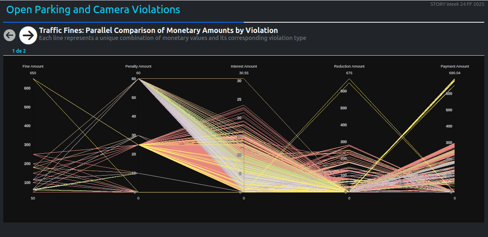</td>        
  </tr>
  <tr>
    <td></td>
    <td>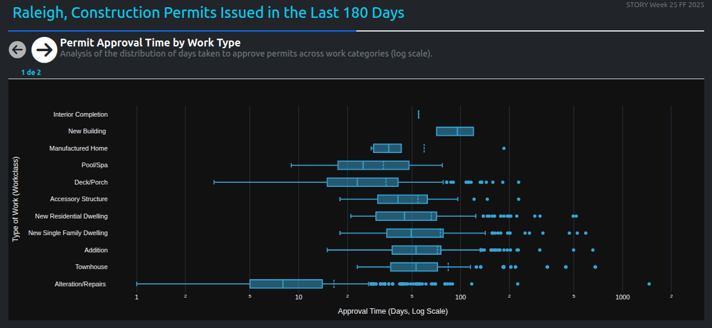</td>
    <td></td>        
  </tr>
  <tr>
    <td>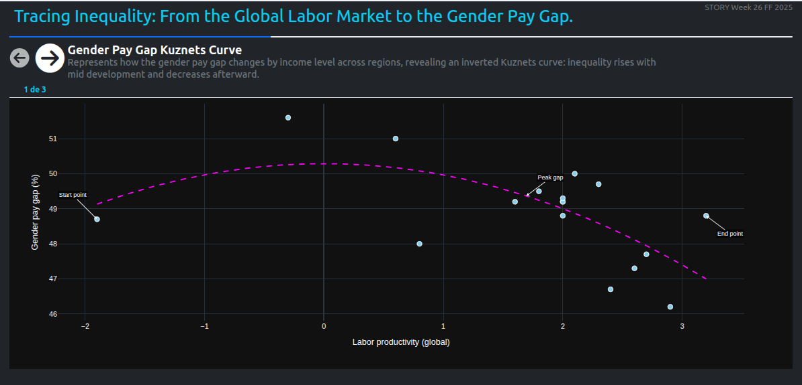</td>
    <td>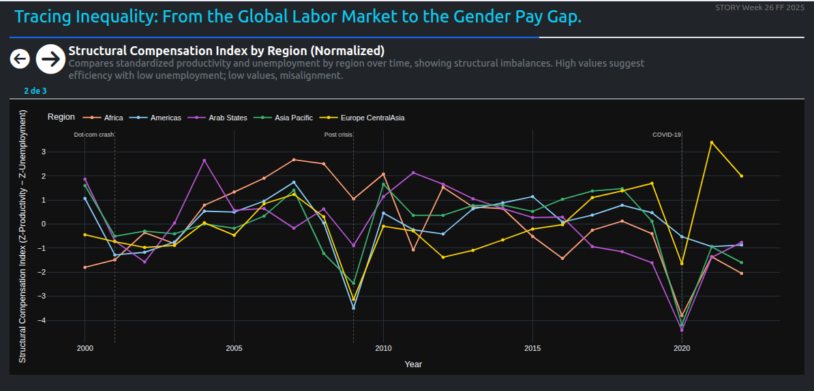</td>
    <td>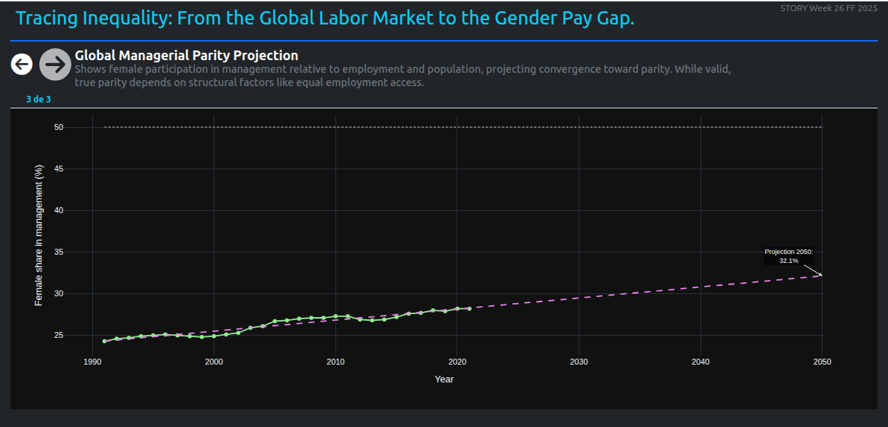</td>        
  </tr>
  <tr>
    <td>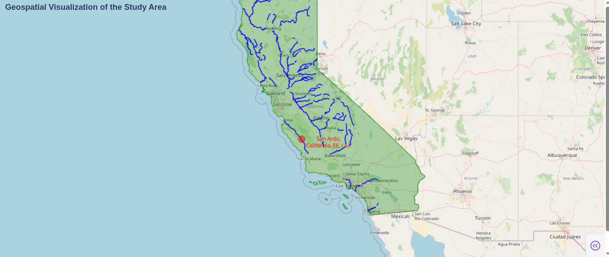</td>
    <td>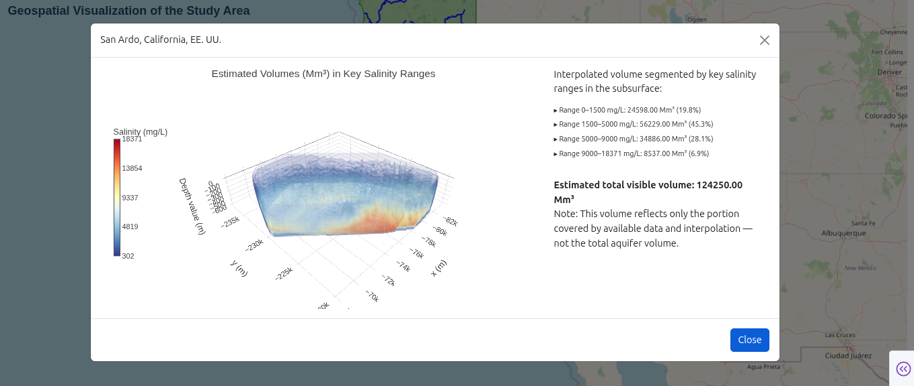</td>
    <td>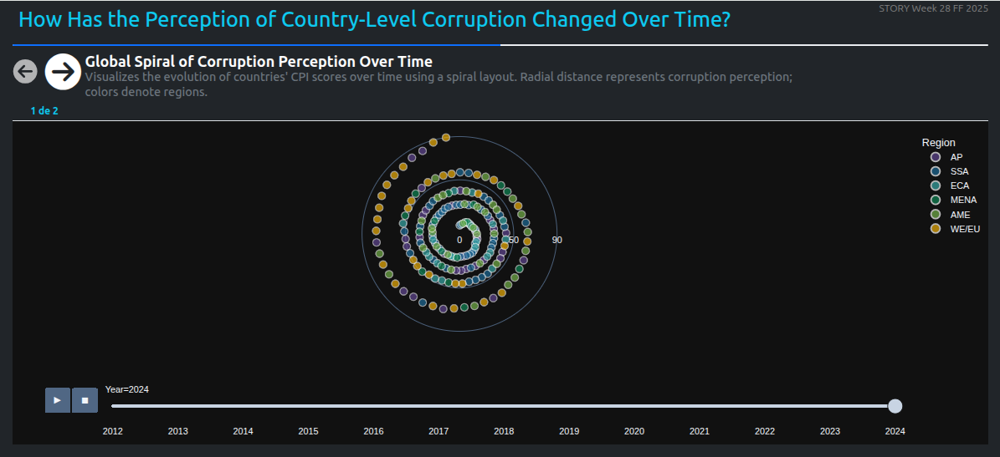</td>        
  </tr>
</table>

---

## 🚀 Tools used

- [Plotly](https://plotly.com/python/) – for generating interactive charts.
- Python 3.x
- Public or randomly generated datasets.

---

## 💡 Note

This project is not focused on deep analysis or statistical rigor — it's about **exploring how data can tell visual stories** using Plotly.

---

## 🔗 Want to Explore More?

If you're looking for more examples or deeper use cases, the  
[Plotly Community Forum](https://community.plotly.com/) is a helpful place to browse ideas shared by other users.
